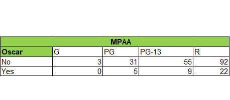

# Analysis 

To predict which movie will receive an Oscar for Best Picture Category this year, I analyzed the data to see if there is any correlation between certain features and Oscar winning. And if so, which features have the biggest impact on winning an Oscar? 

thanks to the project  [and-the-award-goes-to](https://github.com/scruwys/and-the-award-goes-to),
(from which the data was taken) and after i narrowed it down to the features that seem to be the best predictors,
the model used the following features:

-	Other awards show: BAFTA, Golden Globe, Guild
-	Running Time
-	Box Office
-	Budget
-	IMDb score
-	RT audience score
-	RT critic score
-	Number of actors
-	Number of writers
-	Release date
-	MPAA

## Other Awards Show 

It is well known that other ceremonies serve as a kind of predictor for winning an Oscar. If a movie has won the Golden Globe, BAFTA, or the Guild, most of us would think it would probably also win an Oscar.
To test this, i used the Fisher's exact test in R. Here are the results.

### Fisher's Exact Test

BAFTA | p-value = 6.362e-05 | 95 percent confidence interval: 2.284972 to 14.175734 | odds ratio: 5.695619  
Guild | p-value = 0.0002651 | 95 percent confidence interval: 2.194201 to 19.321418 | odds ratio:  6.488601  
Golden Globe | p-value = 3.817e-07 | 95 percent confidence interval:3.084258 to 16.737340 | odds ratio: 7.041181 

As you can see the P-value in all 3, is smaller than 0.05 > There is a positive relationship between winning an Oscar and winning another award show.                                          
Therefore, it seems that the 'Other Awards Show' is a good predictor of winning an Oscar.

## MPAA

The MPAA administers a motion picture rating system used in the United States to rate the suitability of films' themes and content for certain audiences.
“G” – for general audiences, “PG” – parental guidance suggested, “PG-13” – parents strongly cautioned, “R” – restricted.
Does the rate of suitability have an impact on winning an Oscar? below is the distribution of the given variables:

MPAA | p-value = 0.8042
The p-value is larger than 0.05 > give us a weak certainty.
However, looking at the the number of R-rated movies that were nominated and won an Oscar we can see that it is significantly higher than the other variables. 

## Release Date 

As you can see, movies released in December received the highest number of Oscar nominations and winnings. This is beacuse the Oscar season.

The Oscar season is the time period in which Hollywood studios release or promote the films they consider most likely to be critically acclaimed, hoping to win at the Academy Awards. Oscar season usually begins in the late-fall and early-winter, around November, and ends on December 31 of that year,[1] although the date in which the summer blockbuster season ends, and the Oscar season begins, are ambiguous, and dependent on the year. 

