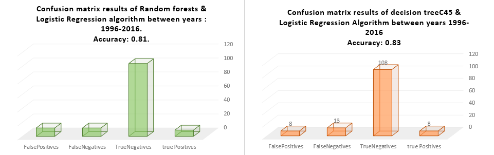
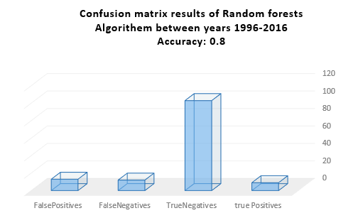
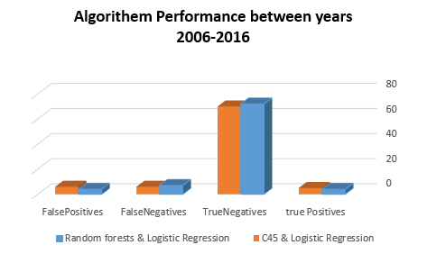
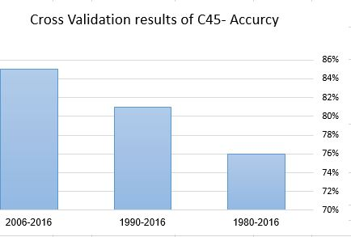

# The Report

To maximize the highest level of accuracy, i used several AI Algorithms for constructing decision trees, such as random forests, random decision forests and C45 decision tree. Then i compared the algorithms with each other to select the best one.

I used a logistic regression model that returned the movie with the highest probability of winning among those the algorithm predicted as winners.

To calculate the accuracy of the algorithm, I created a function that used a confusion matrix (by Accord.Net Framework). 
In each iteration, I calculated the accuracy and weighed the results. 

Here are the results:

As you can see the algorithms are almost identical and there is no significant difference.

### Does the time affect the outcome? 
I reduced the size of the data and chose between 2006-2016.

As you can see, the results are better, after I have reduced the range of the years. This can be related to the fact that times have changed. Films that have won in the past were not sure to win today. The accuracy now is 84% for C45, and 85% for Random Forest.

### Cross-Validation

To double check the calculation of the algorithm's accuracy, i used  cross-validation to estimate the performance of the decision tree model. Here are the results:

See that the results are no different.
